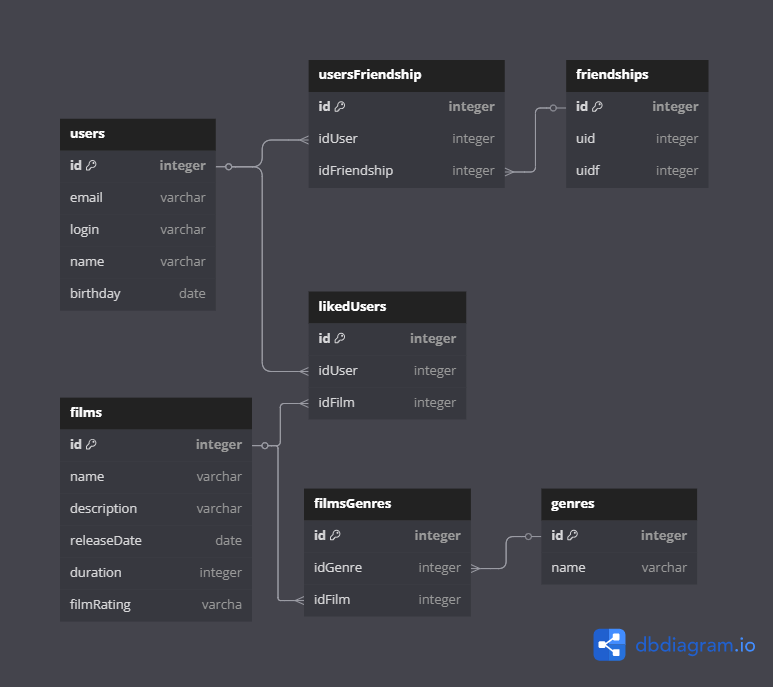

# java-filmorate
Template repository for Filmorate project.

## Схема БД


## Описание таблиц и их полей
### users
- ***id* (PK)** - id пользователя;
- *email* - адрес электронной почты;
- *login* - логин;
- *name* - имя пользователя;
- *birthday* - дата рождения пользователя.
### usersFriendship
- ***id* (PK)** - уникальный идентификатор записи;
- *idUser* - id пользователя;
- *idFriendship* - идентификатор дружеской связи.
### friendships
- ***id* (PK)** - уникальный идентификатор записи;
- *uid* - идентификатор пользователя;
- *uidf* - идентификатор пользователя-друга.
### films
- ***id* (PK)** - уникальный идентификатор фильма;
- *name* - наименование фильма;
- *description* - описание фильма;
- *releaseDate* - дата выхода фильма;
- *duration* - продолжительность фильма в минутах;
- *filmRating* - рейтинг Ассоциации кинокомпаний (MPA).
### likedUsers
- ***id* (PK)** - уникальный идентификатор записи;
- *idUser* - id пользователя;
- *idFilm* - id фильма.
### filmsGenres
- ***id* (PK)** - уникальный идентификатор записи;
- *idGenre* - id жанра;
- *idFilm* - id фильма.
### genres
- ***id* (PK)** - уникальный идентификатор жанра;
- *name* - название жанра.

## SQL-запросы
### Получить всех пользователей
   ```sql
   SELECT * FROM users;
   ```
### Найти пользователя по id
   ```sql
   SELECT * FROM users WHERE id = parameter;
   ```
### Получить все фильмы
   ```sql
   SELECT * FROM films;
   ```
### Получить количество лайков фильма
   ```sql
   SELECT COUNT(*) AS likes
   FROM likedUsers
   WHERE idFilm = parameter;
   ```


